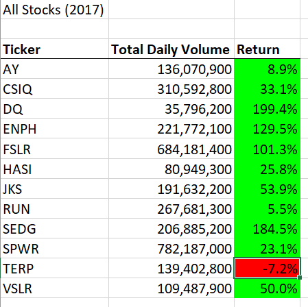
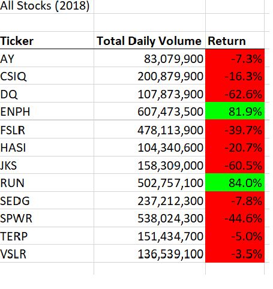

# stock-analysis

## Table of Contents

- [Overview the Project](#overview-the-project)
- [Results](#results)
- [Summary](#summary)
  - [Advantages and Disadvantages](#advantages-and-disadvantages)
  - [How do these Pros and Cons apply](#how-do-these-pros-and-cons-apply)

## Overview the Project

The motivation behind this venture was to refactor a Microsoft Excel VBA code to gather certain stock data in the years 2017 and 2018 and decide if the stocks merit contributing. This cycle was initially finished in a comparative arrangement, notwithstanding, the objective for this round was to expand the productivity of the first code. We’ll determine whether refactoring your code successfully made the VBA script run faster. Finally, we just want to make the code more efficient—by taking fewer steps, using less memory, or improving the logic of the code to make it easier for future users to read. 

## Results

Firstly, I started by replicating the code that was expected to make the infobox, diagram headers, ticker cluster, and to enact the suitable worksheet. The following is the guidance and code as written in the record.
  Sub AllStocksAnalysisRefactored()
    Dim startTime As Single
    Dim endTime  As Single

    yearValue = InputBox("What year would you like to run the analysis on?")

    startTime = Timer
    
    'Format the output sheet on All Stocks Analysis worksheet
    Worksheets("All Stocks Analysis").Activate
    
    Range("A1").Value = "All Stocks (" + yearValue + ")"
    
    'Create a header row
    Cells(3, 1).Value = "Ticker"
    Cells(3, 2).Value = "Total Daily Volume"
    Cells(3, 3).Value = "Return"

    Dim tickers(12) As String
    
    tickers(0) = "AY"
    tickers(1) = "CSIQ"
    tickers(2) = "DQ"
    tickers(3) = "ENPH"
    tickers(4) = "FSLR"
    tickers(5) = "HASI"
    tickers(6) = "JKS"
    tickers(7) = "RUN"
    tickers(8) = "SEDG"
    tickers(9) = "SPWR"
    tickers(10) = "TERP"
    tickers(11) = "VSLR"

    Worksheets(yearValue).Activate
    
    RowCount = Cells(Rows.Count, "A").End(xlUp).Row
    
    '1a) Create a ticker Index
    tickerIndex = 0
    
    '1b) Create three output arrays
    Dim tickerVolumes(12) As Long
    Dim tickerStartingPrices(12) As Single
    Dim tickerEndingPrices(12) As Single
    
    ''2a) Create a for loop to initialize the tickerVolumes to zero.
    
    For i = 0 To 11
        tickerVolumes(i) = 0
    Next i
        
    ''2b) Loop over all the rows in the spreadsheet.
    
    Worksheets(yearValue).Activate
    
    For i = 2 To RowCount
        
        If Cells(i, 1).Value = tickers(tickerIndex) Then
        
            '3a) Increase volume for current ticker
            tickerVolumes(tickerIndex) = tickerVolumes(tickerIndex) + Cells(i, 8).Value
            
        End If
            
        '3b) Check if the current row is the first row with the selected tickerIndex
        If Cells(i, 1).Value = tickers(tickerIndex) And Cells(i - 1, 1).Value <> tickers(tickerIndex) Then
        
            tickerStartingPrices(tickerIndex) = Cells(i, 6).Value
            
        End If
        
        '3c) check if the current row is the last row with the selected ticker
        
        If Cells(i, 1).Value = tickers(tickerIndex) And Cells(i + 1, 1).Value <> tickers(tickerIndex) Then
        
            tickerEndingPrices(tickerIndex) = Cells(i, 6).Value

            '3d Increase the tickerIndex.
            tickerIndex = tickerIndex + 1
            
        End If
    
    Next i
    
    '4) Loop through your arrays to output the Ticker, Total Daily Volume, and Return.
    For i = 0 To 11
        
        Worksheets("All Stocks Analysis").Activate
        
        
    Next i
    
    'Formatting
    Worksheets("All Stocks Analysis").Activate
    Range("A3:C3").Font.FontStyle = "Bold"
    Range("A3:C3").Borders(xlEdgeBottom).LineStyle = xlContinuous
    Range("B4:B15").NumberFormat = "#,##0"
    Range("C4:C15").NumberFormat = "0.0%"
    Columns("B").AutoFit

    dataRowStart = 4
    dataRowEnd = 15

    For i = dataRowStart To dataRowEnd
        
        If Cells(i, 3) > 0 Then
            
            Cells(i, 3).Interior.Color = vbGreen
            
        Else
        
            Cells(i, 3).Interior.Color = vbRed
            
        End If
        
    Next i
 
    endTime = Timer
    MsgBox "This code ran in " & (endTime - startTime) & " seconds for the year " & (yearValue)
    End Sub

## Summary
Refactoring code is a critical interaction with the ultimate objective of making code run as quickly and proficiently as could really be expected. By and large, it is an extraordinary strategy when utilized effectively, every one of the little changes makes your code somewhat better and leaves the application in a functioning state

### Advantages and Disadvantages
#### Advantages
> - VBA interpretation (Excel) of code can reveal patterns that are not easy to see in the source.
> - Discovering the main driver of a potential bug should be possible with refactoring
> - Utilizing Excel stream shows program rationale in a more conceivable way, not attached to the request that the basic code is composed. 

#### Disadvantages
> - The refactoring interaction can influence the testing results
> - Refracting a steady code to apply an alternate arrangement of rationale could be exorbitant or bring new bugs into the framework

### How do these Pros and Cons apply?
> To refactor the code, testing must be finished with each new expansion to check for the productivity of the new code. Lessening the number of circles diminishes the memory required for preparing the information, which decreases the run time and upgrades the presentation of the content.
